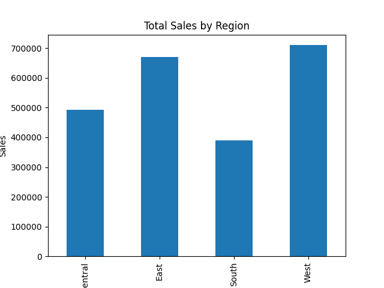

# Sales Analytics Project (SQL + Python)

## Project Overview

This project analyzes retail sales data using **MySQL (SQL)** for data querying and **Python (Pandas & Matplotlib)** for visualization.

The goal is to extract business insights such as revenue performance, regional trends, product performance, and customer segment behavior.

---

## Tools & Technologies

* SQL (MySQL Workbench)
* Python (Pandas, Matplotlib)
* Jupyter Notebook
* GitHub

---

## Dataset

Retail sales dataset containing:

* Orders and shipping information
* Customer segments
* Product categories
* Regional sales data
* Transaction-level revenue

---

## SQL Analysis Performed

The following business questions were answered using SQL:

* Total revenue generated
* Sales performance by region
* Sales performance by category
* Monthly sales trends
* Top-performing products
* Average order value
* Customer segment contribution

SQL queries are available here:

```
outputs/sql/sales_analysis.sql
```

---

## Key Insights

* Total Revenue: **$28,609.93**
* West region generated the highest sales.
* Furniture category contributed the most revenue.
* Consumer segment accounted for the majority of purchases.
* A small number of products drive a large portion of revenue.

---

## Project Structure

```
sales-analytics-sql-python/
│
├── outputs/
│   ├── sql/
│   │   └── sales_analysis.sql
│   ├── region_sales.csv
│   ├── category_sales.csv
│   ├── monthly_sales.csv
│   └── top_products.csv
│
├── sales_analysis.ipynb
├── sales_by_region.png
├── sales_growth.png
└── README.md
```

---

## Visualizations

### Sales by Region



### Monthly Sales Growth


---

## What This Project Demonstrates

* Writing analytical SQL queries
* Data cleaning and transformation
* Aggregation and business KPI analysis
* Exporting analytical datasets
* Data visualization using Python
* End-to-end analytics workflow

---

## Author

Meena Potlacheruvu
Data Analytics Portfolio Project

